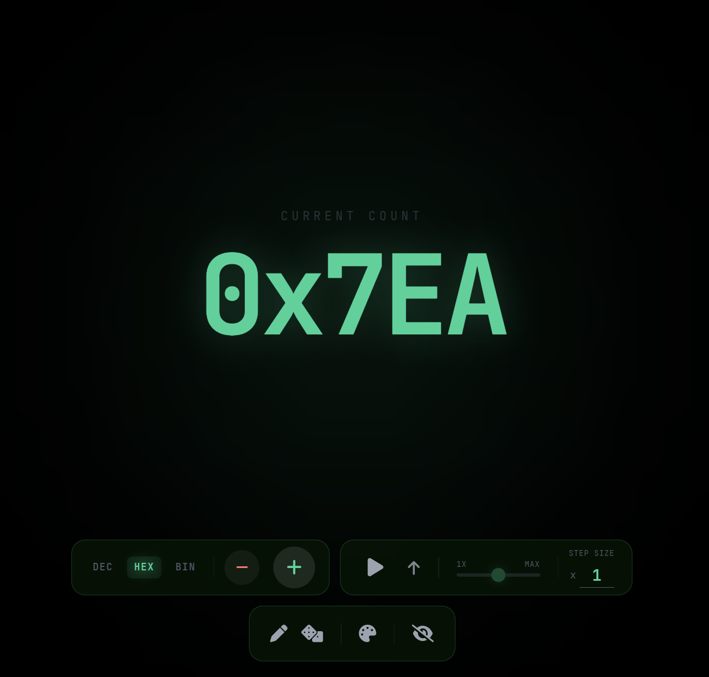

# Pro Counter

A premium, single-file HTML counter application designed with modern aesthetics and advanced functionality.

## Features

- **Base Conversion**: Toggle between Decimal, Hexadecimal, and Binary (with 32-bit Two's Complement for negatives).
- **Automation**: Auto-inc/dec with variable speed and direction control.
- **Theming**: 5 distinct themes (Sky, Terminal, Paper, Vapor, Carbon) with glassmorphism UI.
- **Sound Effects**: Procedural audio feedback for clicks and UI interactions (Web Audio API).
- **Accessibility**: Full keyboard support with visible focus states and ARIA labels.
- **Responsive**: Adaptive font sizing for large numbers and binary strings.

## Usage

Simply open `counter.html` in any modern web browser. 

### Controls
- **+/-**: Increment or Decrement count.
- **Play/Pause**: Start or stop automation.
- **Arrow Keys**: Up/Down to increment/decrement.
- **Spacebar**: Toggle automation.
- **Pencil Icon**: Set a specific starting value.
- **Dice Icon**: Randomize the counter value.
- **Palette Icon**: Cycle through themes.
